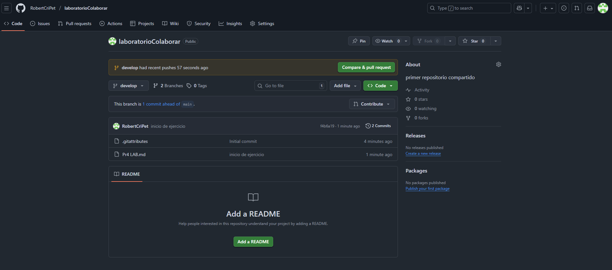
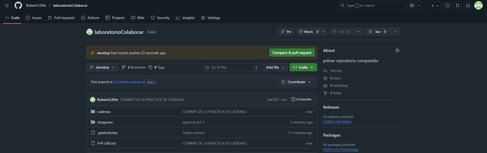
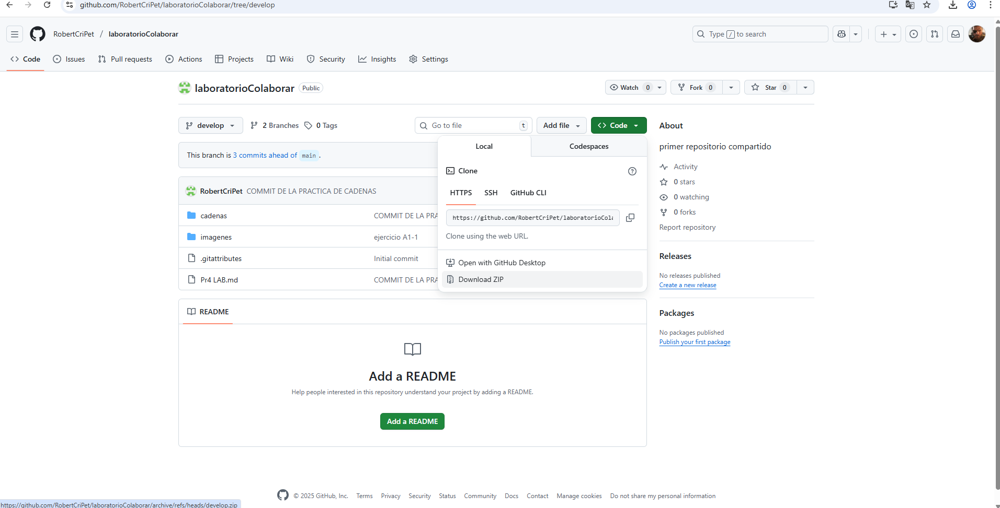
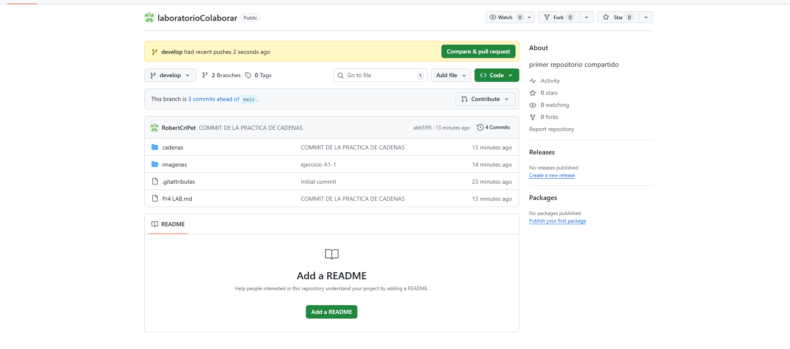
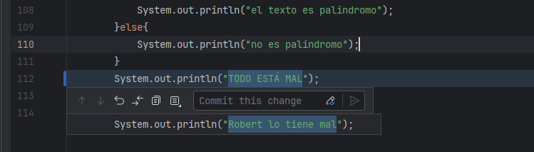
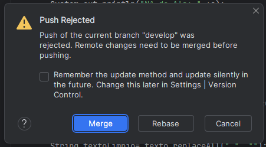
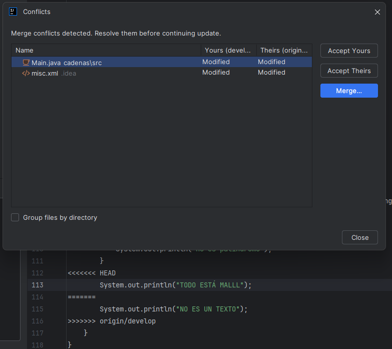

# Practica 4 - Investigación sobre trabajo colaborativo

Esta práctica se realizará por parejas, pero ambos alumnos deberán de entregar el PDF en aules. Se va a trabajar la colaboración en proyectos mediante GitHub.

Nombre Alumno1: Robert Cristian Petric Petric 

Nombre Alumno2: Raúl Romero Pérez 

URL del repositorio:

El alumno 1 deberá rellenar los apartados que aparece A1, y el alumnos 2 en A2.  
Las imágenes y este mismo archivo con su versión PDF deberán estar en GitHub.

1. A1: Cread un repositorio "laboratorioColaborar" en GitHub (Ponedlo público).

2. A2: Investigad sobre como utilizar GIT desde IntelliJ para explicarlo a A1.
3. A1: Subid una práctica de "Programación" desde IntelliJ

4. A2: Descargad el repositorio de A1.

5. A2: Haced modificaciones en el código y subidlo mediante IntelliJ.

6. A1: Descarga el programa actual y modifica una parte.

7. A2: Modifica la misma parte que A1 de manera que surja un coinflicto
8. A1 y A2 : Subid los cambios y resolved el conflicto.

9. A1:Investigad sobre la herramienta "CodeWithMe".  
10. A2: Investigad sobre la herramienta "GitHubCopilot".

Vídeos de ayuda:  
Subir proyecto desde GIT: https://www.youtube.com/watch?v=6WtA2dUDvPY  
Clonar repositorio: https://www.youtube.com/watch?v=rcQBgm5vid0
Colaborar con GIT: https://www.youtube.com/watch?v=ibmQkhAzk5I  

